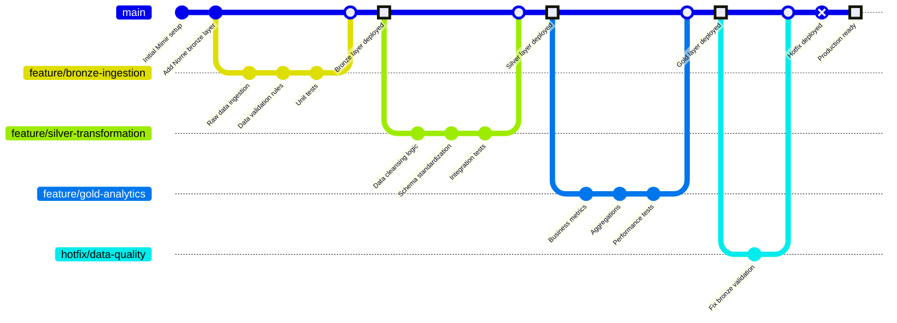
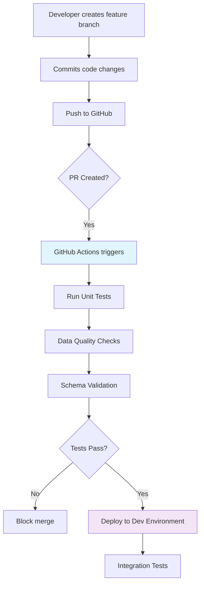
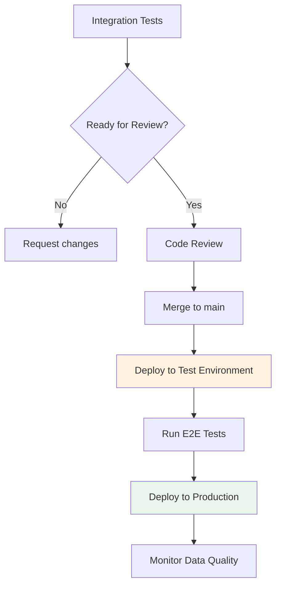
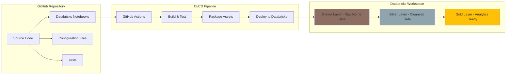

# Mimir Kalkulator

---

---
::: title

## CI/CD Pipeline Flow

:::

<grid drop="left" border="4px solid white">

</grid>

<grid drop="right">

</grid>

---

## Medallion Architecture Deployment

