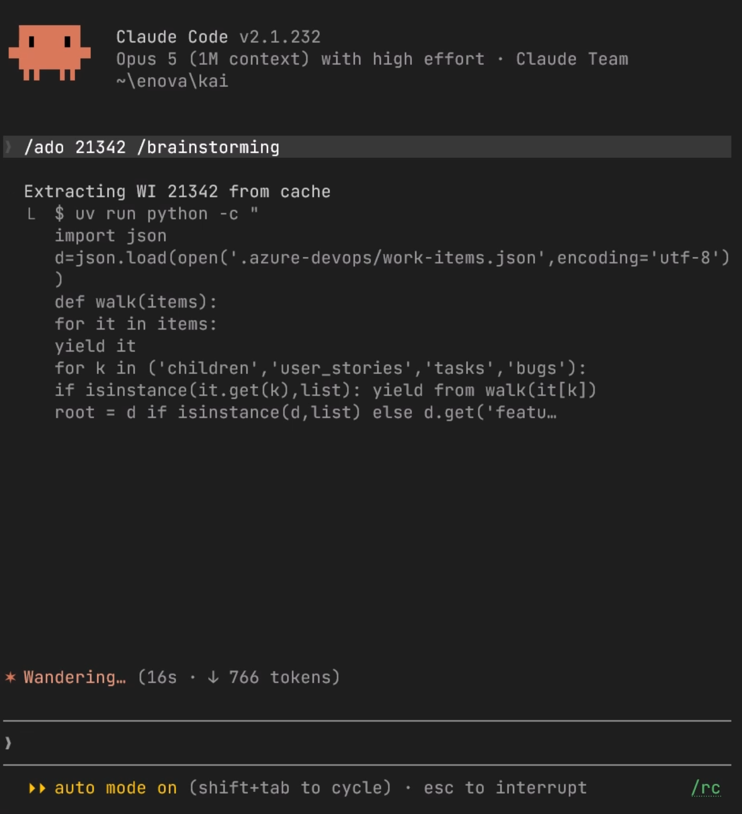
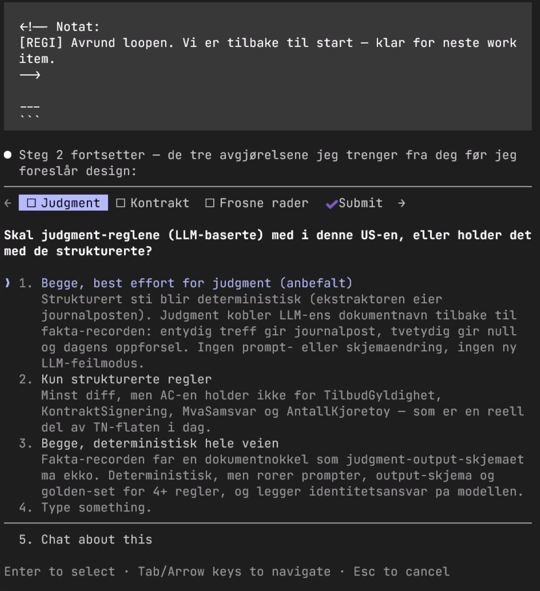
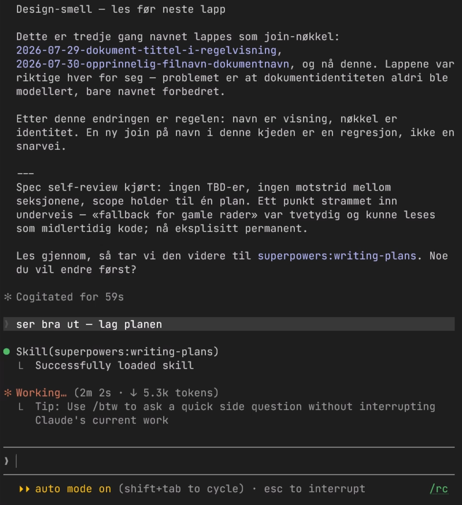
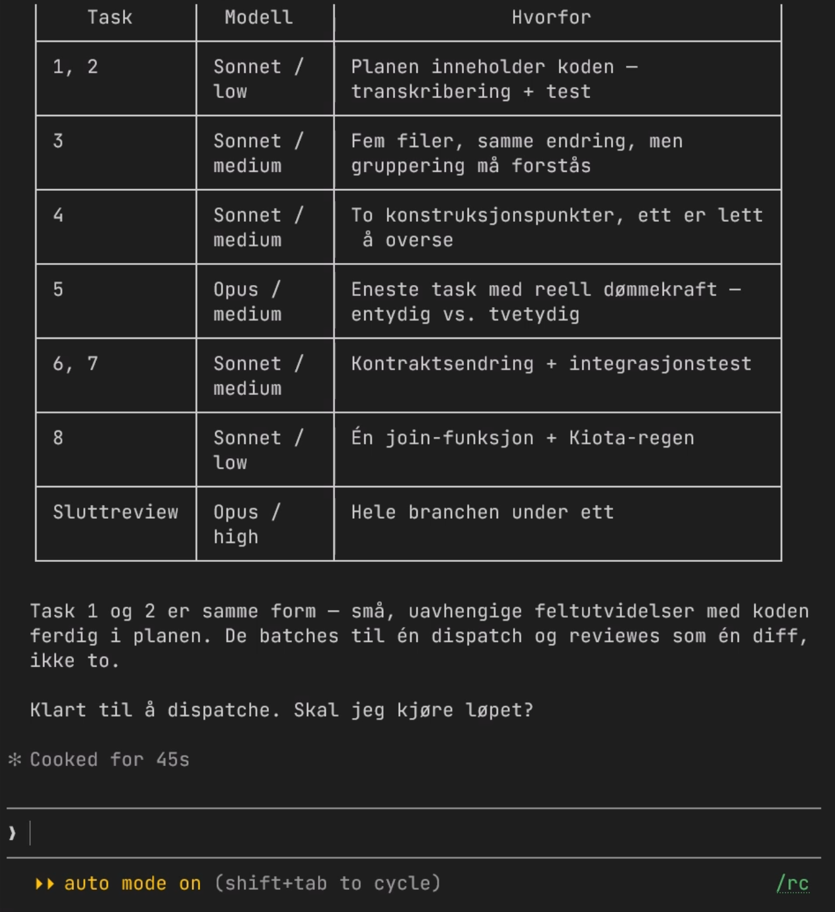
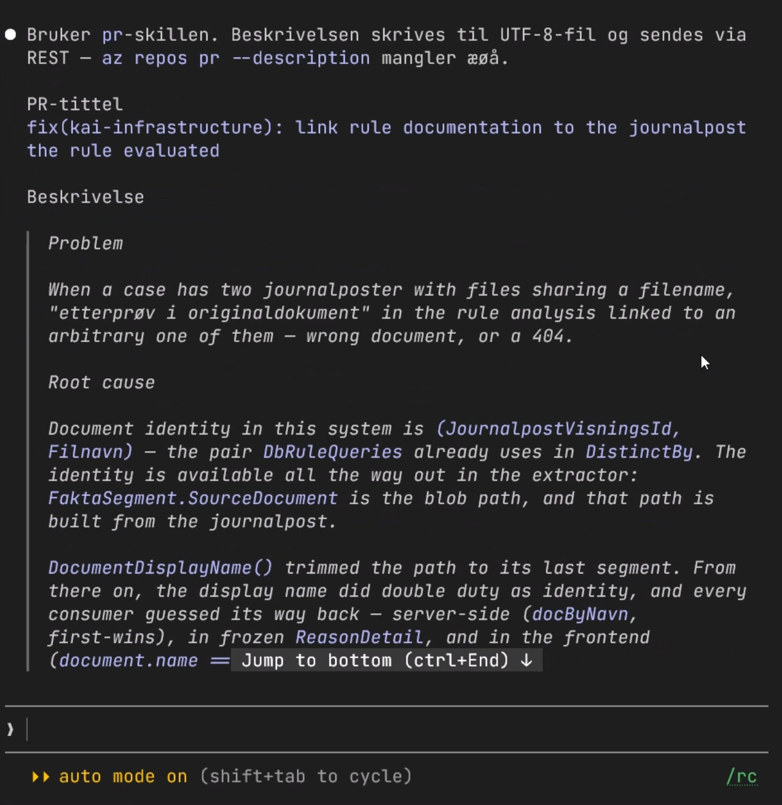

<style>
  /* Export-safe flow diagram (replaces mermaid — renders identically in browser, PDF and PPTX) */
  .flow { display: flex; align-items: stretch; gap: 10px; margin: 28px 0; }
  .flow .node {
    flex: 1; display: flex; flex-direction: column; justify-content: center;
    text-align: center; background: var(--ds-neutral-surface);
    border: 2px solid var(--ds-fjellgronn); border-radius: 8px;
    padding: 18px 12px; font-size: 1.05rem; line-height: 1.3;
  }
  .flow .node.hl { background: var(--ds-fjordgronn); border-color: var(--ds-fjellgronn); }
  .flow .node strong { display: block; margin-bottom: 4px; }
  .flow .node small { color: var(--ds-neutral-subtle); font-size: 0.82em; }
  .flow .node.hl small { color: var(--ds-fjellgronn-text); }
  .flow .arrow { display: flex; align-items: center; font-size: 1.8rem; color: var(--ds-fjellgronn); }
  /* Fan-out/in: main → N worktrees → main */
  .fan { display: flex; align-items: stretch; gap: 12px; margin: 26px 0; }
  .fan .trunk {
    align-self: center; background: var(--ds-fjordgronn); border: 2px solid var(--ds-fjellgronn);
    border-radius: 8px; padding: 22px 16px; font-weight: 700; color: var(--ds-fjellgronn-text);
    font-family: "Consolas", "Monaco", monospace;
  }
  .fan .branches { display: flex; flex-direction: column; gap: 12px; flex: 1; }
  .fan .branches .node {
    display: flex; flex-direction: column; justify-content: center; align-items: flex-start;
    text-align: left; background: var(--ds-neutral-surface); border: 2px solid var(--ds-fjellgronn);
    border-radius: 8px; padding: 12px 16px;
  }
  .fan .branches .node strong { display: block; font-family: "Consolas", "Monaco", monospace; margin-bottom: 2px; }
  .fan .branches .node small { color: var(--ds-neutral-subtle); font-size: 0.82em; }
  .fan .conn { display: flex; flex-direction: column; justify-content: space-around; align-items: center; color: var(--ds-fjellgronn); font-size: 1.7rem; }
  /* Skjermbilde/GIF til høyre: hele bildet synlig, aldri oppå tittelen */
  section.media-right { padding-right: 480px; }
  section.media-right > h1 { margin-right: -420px; }  /* tittel + linje beholder full bredde */
  section.media-right::after { padding-right: 60px; } /* sidetall arver section-padding — nullstill */
  section.media-right .shot {
    position: absolute; top: 150px; bottom: 90px; right: 60px; width: 400px;
    display: flex; align-items: center; justify-content: center;
  }
  section.media-right .shot img {
    max-width: 100%; max-height: 100%; width: auto; height: auto;
    object-fit: contain; border-radius: 8px;
    border: 1px solid var(--ds-neutral-border);
    box-shadow: 0 4px 16px rgba(0,0,0,0.15);
  }
</style>


<!-- _class: lead -->
<!-- _paginate: false -->


# KI-drevet utvikling

Hvordan vi jobber med Agenter og skills i Kai

Bjørn Kristian Punsvik
Team Virkemiddel og KI
2026-08-19

<!-- Notat:
[REGI] La tittelen puste. Kort velkomst, ramme inn: dette er del 1 — hvordan VI jobber. Robert tar deling av skills på tvers etterpå.
[STIKKORD] Teknisk fokus, åpent for alle.

[TEMPERATURMÅLING] Håndsopprekning før vi starter — «bare så jeg vet hvem jeg snakker til»:
1. Hvem har brukt en KI-assistent til koding denne uka? (Copilot, Claude, ChatGPT — alt teller)
2. Hvem har latt en agent kjøre selv — endre flere filer, kjøre tester — ikke bare autocomplete?
3. Hvem har skrevet en skill, en CLAUDE.md eller en egen instruksfil til agenten sin?
4. Hvem har kjørt to eller flere agenter samtidig?

[TOLKNING] Trappa faller raskt fra 1 til 4 — det er poenget. Si det høyt: «da vet jeg hvor jeg skal legge lista.»
- Få hender på 1–2 → bruk mer tid på grunnlagsdelen, gå saktere gjennom begrepene.
- Mange på 3–4 → kjapt gjennom begreper, mer tid på worktrees, tall og fallgruver.
[REGI] Hold det til under to minutter. Ikke kommenter hver hånd — tell, nikk, gå videre.
-->

---

# Hvorfor dette?

<div class="columns-2">
<div>

**Før**

- Grovarbeid stjeler tid fra erfarne blikk
- Kunnskap låst i hoder — DevOps, database, backend
- Endring på tvers av alle lag gjøres manuelt, fil for fil

</div>
<div>

**Nå**

- Agenten tar gravarbeidet — parallelt — vi styrer
- Kunnskap kodet som skills → dukker opp i andres agent-sesjoner
- Nytt felt gjennom alle lag (frontend → API → domene → DB) i ett løp

</div>
</div>

<!-- Notat:
[REGI] Ærlig ramme: ikke ETT brennende smertepunkt drev oss hit — poenget er en annen måte å jobbe på. Erfarne blikk fokuseres der koden trenger det mest; gravarbeidet flyttes til agenten, ofte parallelt.
[STIKKORD] Kunnskap i skills påvirker andres agent-sesjoner — vær bevisst på hva som legges der.
-->

---

<!-- _class: accent -->

# Visjon

KI er en kollega i hele utviklingsløpet — ikke en autocomplete.

Arbeidsmåten vår er **kodet som skills**: delt, versjonert, gjenbrukbar.

<!-- Notat:
[REGI] Punchy. Dette er kjernebudskapet — alt annet henger under her.
[STIKKORD] "Skills = teamets arbeidsmåte i kode."
-->

---

<!-- _class: invert -->

# Felles grunnlag

Begrepene — og hvor mennesket skal stå

<!-- Notat: Seksjonsskille. Kort: to minutter på ord, to på DDD. Så er alle med på resten. -->

---

# Begreper — modellen og motoren

<div class="columns-2">
<div>

**LLM** — språkmodellen selv (Opus, Fable, Haiku). Kan bare én ting: lese tekst, gjette neste tekst. Ingen minne, ingen tilgang.

**Context window** — alt modellen ser i ett kall: prompt, filer, tool-svar. Fullt vindu = dårligere svar. Derfor delegerer vi.

</div>
<div>

**Harness** — programmet rundt modellen (Claude Code). Gir den tools, kjører loopen, holder styr på filer og permissions.

**Tools** — det harnesset lar modellen gjøre: lese fil, redigere, kjøre Bash, kalle API. Uten tools: bare prat.

**Agent** = LLM + harness + tools + oppgave, i loop til den er ferdig.

</div>
</div>

<!-- Notat:
[REGI] Ikke gå dypt. Poenget: modellen er dum og blind alene — harnesset gir den hender. Alt vi snakker om etterpå er å styre harnesset, ikke modellen.
[STIKKORD] Context window er en budsjettpost. Det forklarer subagenter senere.
-->

---

# Begreper — laget vi bygger selv

<div class="columns-2">
<div>

**Skill** — markdown-fil med instruks: «slik gjør vi X her». Agenten plukker den selv når oppgaven passer. Ligger i repoet, versjonert.

**Plugin** — pakke med skills som deles på tvers av repoer (`superpowers`).

**MCP** — standard for å koble agenten til eksterne systemer (ADO, Microsoft Learn) uten å skrive egen integrasjon.

</div>
<div>

**Subagent** — egen agent med eget context window, får én avgrenset oppgave, leverer svaret tilbake. Hovedtråden holdes ren.

**Worktree** — isolert kopi av repoet på egen branch. Én per work item → flere agenter jobber samtidig uten å tråkke på hverandre.

</div>
</div>

<div class="source">Skill = instruks · Subagent = arbeidskraft · Worktree = arbeidsplass</div>

<!-- Notat:
[REGI] Dette er de fire ordene som går igjen i resten av foredraget. Skill er det viktigste — det er der arbeidsmåten vår faktisk bor.
-->

---

# Hvor skal innsatsen ligge? (DDD)

<div class="columns-3">
<div class="box box--warning">

### Core domain

Det som gjør Enova til Enova. Regelverk, virkemidler, saksbehandling.

Ingen kan kjøpe det. Feil her er dyre.

</div>
<div class="box box--info">

### Supporting

Nødvendig, men ikke særegent. Rapportuttrekk, admin-flater, importjobber.

Må finnes, må stemme — men gir ikke konkurransefortrinn.

</div>
<div class="box box--success">

### Generic

Løst for alle: auth, logging, CRUD, CI/CD, setup, migrasjoner.

Hyllevare. Verdien er at det bare virker.

</div>
</div>

Domain-Driven Design deler systemet etter **hvor verdien faktisk sitter** — ikke etter teknisk lag.

<!-- Notat:
[REGI] Rask innføring for de som ikke har DDD i ryggmargen. Poeng: ikke alle deler av systemet fortjener like mye seniortid.
-->

---

# Derfor: menneske i core, agent i resten

<div class="columns-2">
<div>

**Mennesket eier core domain**

- Forstå regelverket og hva saksbehandler faktisk trenger
- Modellere domenet, sette navn og bounded contexts
- Arkitektur og beslutninger som er dyre å reversere (`adr-skill`)
- Agenten skriver gjerne koden — men vi eier *hva* som skal lages

</div>
<div>

**Agent + skills tar supporting og generic**

- Boilerplate, CRUD, tester, migrasjoner, setup
- Nytt felt gjennom alle lag i ett løp
- Drift og gravearbeid: pipeline-logger, KQL, SQL
- Skills koder *vår* variant av hyllevaren, så den blir lik hver gang

</div>
</div>

<div class="box box--warning">

Fella: agenten er like rask i core domain — og derfor er det der du må bremse mest.

</div>

<!-- Notat:
[REGI] Dette er linsa for resten av foredraget. Når vi ser loopen etterpå: approval gaten på spec+plan er nettopp der core domain-vurderingen skjer.
[STIKKORD] Kobler til fallgruve-sliden senere: «kode er billig»-fella setter presedens — verst i core.
-->

---

<!-- _class: invert -->

# Loopen vår

Fra work item til merge

<!-- Notat: Seksjonsskille. Klikk videre til diagrammet. -->

---

# Hele løpet på ett bilde

<div class="flow">
  <div class="node hl">Work item<br><small>meeting-gap · ado</small></div>
  <div class="arrow">&rarr;</div>
  <div class="node">Brainstorm<br><small>superpowers</small></div>
  <div class="arrow">&rarr;</div>
  <div class="node">Spec +<br>plan<br><small>superpowers</small></div>
  <div class="arrow">&rarr;</div>
  <div class="node">Implementer<br><small>superpowers</small></div>
  <div class="arrow">&rarr;</div>
  <div class="node">PR<br><small>pr</small></div>
  <div class="arrow">&rarr;</div>
  <div class="node hl">Merge<br><small>CI</small></div>
</div>

Hvert steg styres av en **skill** — `superpowers`-pluginen driver kjernen, repo-skills gir domene- og driftskunnskap.

<!-- Notat:
[REGI] Dette er ryggraden i hele presentasjonen. Pek på at hvert steg = én skill. Resten av slidene zoomer inn på hvert steg.
-->

---

# Skills — arbeidsmåten i koden

<div class="columns-2">
<div>

- **To lag:** `superpowers`-pluginen (arbeidsmåten, delt på tvers) + repo-skills (domene/drift for kai)
- Versjonert sammen med koden — review i PR som alt annet
- Agenten plukker riktig skill ut fra hva du ber om

</div>
<div>

**22 repo-skills** i dag — et utsnitt:

- Loop: `ado` · `pr` · `branch-hygiene`
- Azure/drift: `ado-pipeline-logs` · `appinsights-kql` · `entra-access` · `deploy-cu`
- Data: `databricks-sql` · `kai-postgres-connect`
- Domene: `kai-docs` · `regelmotor-regel` · `zensical-authoring`
- Arkitektur: `adr-skill` · `api-design`

</div>
</div>

<div class="source">enova/kai/.claude/skills — 22 skills</div>

<!-- Notat:
[REGI] Meta-poenget: en skill er bare en markdown-fil med instruks. Lav terskel for å lage nye.
[STIKKORD] Dette er broa til Roberts del.
-->

---

<!-- _class: media-right -->

# Steg 1 — Work items i Azure DevOps

<div class="shot"></div>

<div class="box box--info">

**`meeting-gap` + `ado`** · fra møte/observasjon → nedbrutt i ADO

</div>

- Behov kommer fra møtetranskripsjoner (`meeting-gap`) eller observerte bugs/features
- `ado`-skill bryter ned til Feature → User Story → Task, lenker parent-child
- Feature fanger *hvorfor* (verdi for saksbehandler), User Story fanger *hvordan*

<!-- Notat:
[REGI] Start der arbeidet faktisk starter. Vi bryter ikke lenger ned manuelt — behov fanges fra møter/observasjoner, ADO-skillen gjør nedbrytningen.
-->

---

<!-- _class: media-right -->

# Steg 2 — Brainstorm & scope

<div class="shot"></div>

<div class="box box--info">

**`superpowers:brainstorming`** · interaktiv scoping

</div>

- Agenten stiller spørsmål via **AskUserQuestion** — vi tar avgjørelsene
- Scope defineres sammen FØR noen skriver kode
- Ingen egne feature-dokumenter lenger — alt går gjennom superpowers-flyten

<!-- Notat:
[REGI] Poeng: vi avklarer intensjon FØR kode. AskUserQuestion tvinger mennesket inn i scopingen.
-->

---

<!-- _class: media-right -->

# Steg 3 — Spec + plan

<div class="shot"></div>

<div class="box box--warning">

**`superpowers`** · spec + plan → venter på godkjenning

</div>

- Utforsker kodebasen, foreslår teknisk design + plan mot akseptansekriteriene
- **Approval gate**: ingenting implementeres før mennesket sier ja

<!-- Notat:
[REGI] Understrek human-in-the-loop. Spec + plan er der vi bremser bevisst — approval gaten.
-->

---

<!-- _class: media-right -->

# Steg 4 — Implementer

<div class="shot"></div>

<div class="box box--success">

**`superpowers:subagent-driven-development`** · plan → kode

</div>

- Jobber mot akseptansekriteriene, reviewer i småsteg — ikke én diger diff
- **TDD-loop**: kjør til tester, linting og format er grønt — ellers på nytt
- Støtte: `api-design`, `adr-skill` når en beslutning er arkitektonisk

<!-- Notat:
[REGI] Her skjer selve kodingen. Poeng: agenten kjører i loop til alt er grønt, vi reviewer småsteg.

1804 tests.
93% Coverage
-->

---

<!-- _class: media-right -->

# Steg 5 — Pull request

<div class="shot"></div>

<div class="box box--success">

**`pr`** · oppretter ADO-PR fra branch → main

</div>

- Lenker work items automatisk, støtter draft
- Branch policies / build validation kjører før merge (`ado-pipelines`)

<!-- Notat:
[REGI] Lukk loopen: koden er nå på vei tilbake til main, sporbar mot work item.
-->

---

# Steg 6 — Merge & cleanup

<div class="columns-2">
<div>

**Merge til main**

- Squash-merge
- God test coverage + CI: grønn PR-pipeline → lite behov for menneskelig review
- Unntak: be om review fra den som kan området best

</div>
<div>

**`branch-hygiene`**

- Finn og rydd merged/stale branches trygt
- Forstår at squash-merge skjuler merged branches

</div>
</div>

<!-- Notat:
[REGI] Avrund loopen. Vi er tilbake til start — klar for neste work item.
-->

---

# Loopen er ikke teori

Hvor ofte hvert steg faktisk kjørte (skill runs, 7 uker):

| Steg | Skill | Runs |
|---|---|---|
| PR | `pr` | 73 |
| Brainstorm | `brainstorming` | 67 |
| Plan + implementer | `writing-plans` + `subagent-driven-development` | 69 |
| Work item | `ado` | 56 |
| Merge & cleanup | `finishing-a-development-branch` | 15 |

<div class="source">kai · ~/.claude/projects · 2026-06-04 → 07-23</div>

<!-- Notat:
[REGI] Knytt rett tilbake til loop-diagrammet på slide 5. Hvert steg jeg tegnet opp har reelle kjøretall bak seg — loopen er innarbeidet, ikke ønsketenkning.
-->

---

# Utviklingen — mars til august 2026

<div class="flow">
  <div class="node"><strong>26. mars</strong>Harnesset på plass<br><small>CLAUDE.md · .claude/ · MCP · 12 skills på to dager</small></div>
  <div class="arrow">&rarr;</div>
  <div class="node"><strong>April–mai</strong>Loopen tar over<br><small>superpowers · pr-skill · create_pr.py · 10 → 98 PR/mnd</small></div>
  <div class="arrow">&rarr;</div>
  <div class="node"><strong>Mai–juni</strong>Koblet til drift<br><small>ADO work items · pipeline-logger · App Service · Postgres MCP</small></div>
  <div class="arrow">&rarr;</div>
  <div class="node"><strong>7.–13. juli</strong>Guardrails + automatisering<br><small>hooks · ADO-scripts · worktrees · App Insights + Databricks</small></div>
  <div class="arrow">&rarr;</div>
  <div class="node hl"><strong>Slutten av juli</strong>Egne domene-playbooks<br><small>nytt-virkemiddel · hent-fra-websak · regelkjøring-rapport</small></div>
</div>

Fra **generisk harness**, til **operasjonell tilgang** på reell prosjekttilstand, til **domenespesifikke playbooks** som kjører Enova-arbeidsflyter.

<!-- Notat:
[REGI] Tidslinjen, datert fra git (first-seen commit).
26. mars: CLAUDE.md, .claude/*, commands/pr.md, .mcp.json og docs/-strukturen adr-skill, kai-docs, obsidian-*, zensical-authoring — egne skills fra dag to.
April–mai: superpowers-plugin 10. april, pr-skill 7. april, create_pr.py 27. mai. PR-volum 10 (mars) → 24 (april) → 98 (mai).
Mai–juni: ado 6. mai, ado-pipeline-logs 21. mai, appservice-container-logs + kai-postgres-connect 5. juni, postgres-MCP 29. juni. Agenten kan nå lese reell tilstand, ikke bare kode.
Juli: første hook (block-commit-on-main) 7. juli, appinsights-kql + databricks-sql samme dag, .worktreeinclude 13. juli, ADO-scripts (link_branch/set_state/add_comment, fetch-failed-tests/coverage) 7.–14. juli.
Poenget: verktøyene ble mer spesifikke, ikke bare flere.
-->

---

# Parallellisering med git-worktrees

Én **worktree per work item** — isolerte kopier av repoet. Flere agenter jobber samtidig, uten å tråkke på hverandre eller bytte branch.

<div style="text-align: center; margin: 8px 0;">



</div>

`chore/nuget-bump` startet **etter** de andre — nye spor er gratis · **53 av 127 sessions kjørte i worktree**

<!-- Notat:
[REGI] Zoom inn på den nyeste arbeidsmåten. Poeng: worktree = full isolert kopi, så N agenter jobber i parallell uten konflikt. Jeg starter et spor, lar agenten jobbe, hopper til neste — ingen branch-bytting, ingen stash.
[STIKKORD] 53 av 127 sessions (7 uker) i worktree — dette er nå normalen, ikke unntaket.
-->

---

<!-- _class: invert -->

# 7 uker i tall

<div class="columns-3">
<div>

## 127
sessions

## 53
i git-worktrees

</div>
<div>

## ~1 680
prompts

## 633
subagent-kall

</div>
<div>

## ~38M
tokens generert

## Opus 4.8
Fable 5 · Haiku

</div>
</div>

Hentet fra Claude Codes egne session-logger

<div class="source">362 skill runs · ~35 skills · Bash 4833 · Edit 1638 · PowerShell 430 — delegering + parallellisering</div>

<!-- Notat:
[REGI] La tallene tale. 53 av 127 sessions i git-worktrees = mange spor i parallell. 633 subagent-kall = mye delegeres, ikke gjort i hovedtråden. ~35 skills = bredden er reell.
[ÆRLIG] Tall er fra mine egne sessions i kai — én utviklers bruk, ikke hele teamet.
-->

---

<!-- _class: invert -->

# «Men hvor fritt får den gå?»

<!-- Notat:
[REGI] Rammen: en utviklervenn ble oppriktig bekymret da jeg fortalte om dette. Det er den ærlige innvendingen, og den fortjener et ordentlig svar — ikke «det går fint».
[STIKKORD] Svaret er ikke tillit til modellen. Svaret er guardrails.
-->

---

# Guardrails rundt agenten

<div class="columns-3">
<div class="box box--success">

### Koden sier ifra

- Tester, kjørt i loop
- Linter + formatter
- **Arkitekturtester** — hvem importerer hva
- Typecheck / build

</div>
<div class="box box--info">

### Harnesset sier stopp

- Hooks blokkerer farlige kommandoer
- Allowlist — spør om resten
- Approval gate på spec + plan
- Ofte read-tilgang

</div>
<div class="box box--warning">

### Prosessen holder

- Worktree — isolert kopi
- PR + branch policies + build
- Squash-merge til main
- Alt i git — alt reversibelt

</div>
</div>

Vi stoler ikke på modellen. Vi stoler på **sjekkene den må gjennom** — de samme som gjelder oss.

<!-- Notat:
[REGI] Kjernesvaret på bekymringen. Poeng: ingenting her er oppfunnet for KI — det er vanlig god praksis, bare håndhevet hardere.
[STIKKORD] Arkitekturtester er den undervurderte: de fanger nettopp det en agent gjør galt — kobler lag som ikke skal snakke sammen.
[ÆRLIG] Et menneske gjør de samme feilene. Forskjellen er tempo — derfor må sjekkene være automatiske, ikke basert på at noen husker.
-->

---

# Autonomi er en skala, ikke en bryter

<div class="flow">
  <div class="node"><strong>Plan mode</strong><br><small>leser, skriver ingenting</small></div>
  <div class="arrow">&rarr;</div>
  <div class="node"><strong>Spør hver gang</strong><br><small>du godkjenner hver handling</small></div>
  <div class="arrow">&rarr;</div>
  <div class="node"><strong>Allowlist</strong><br><small>kjente trygge kommandoer går selv</small></div>
  <div class="arrow">&rarr;</div>
  <div class="node hl"><strong>Fritt i worktree</strong><br><small>isolert branch, sjekkene fanger</small></div>
</div>

**Blast radius er én branch.** Verste utfall: slett worktreen og start på nytt. Prod nås bare gjennom deploy-pipelinen — samme vei som før.

Ansvaret flytter seg ikke. Du eier PR-en, du eier koden, du eier feilen.

<!-- Notat:
[REGI] Dette er svaret til den som er redd for å «miste kontroll». Du velger selv hvor på skalaen du står, per oppgave. Jeg står langt til høyre i generic-kode, langt til venstre i core domain.
[STIKKORD] Flere guardrails → tør gi mer autonomi. Det er derfor de er verdt å bygge først.
[ÆRLIG] Du leser fortsatt diffen. Agentisk utvikling flytter tid fra å skrive til å lese og vurdere — hvis du ikke leser, er det ikke verktøyet som svikter.
-->

---

# Guardrails bygger seg selv

<div class="columns-2">
<div>

**Den positive loopen**

- Testene, linter-reglene og arkitekturtestene som holder agenten i sjakk — er skrevet av agenten
- Akkurat det arbeidet som aldri ble prioritert før: «vi tar det senere»
- Bedre guardrails → tør gi mer autonomi → mer kapasitet → bedre guardrails

</div>
<div>

**Dokumentasjon som lønner seg dobbelt**

- Endelig tid til å skrive den — og den blir lest
- Mennesker tar riktigere valg, agenten tar riktigere valg
- Skills er dokumentasjon som **kjører**: `kai-docs`, `api-design`, `adr-skill`
- ADR-er fanger *hvorfor* — agenten slutter å foreslå det vi allerede forkastet

</div>
</div>

<!-- Notat:
[REGI] Motargumentet til «KI gir dårligere kodebase»: hos oss gikk kvaliteten på guardrails opp, fordi kostnaden ved å bygge dem falt.
[STIKKORD] Dokumentasjon var før ren utgift. Nå har den to lesere — og den ene leser alltid.
-->

---

# Hva funker — og fallgruver

<div class="columns-2">
<div>

**Funker** ✅

- Mye høyere test coverage — og guardrails rundt
- Frigjør fokus → mer gjort, og ting man ellers ikke ville gjort
- Kodehygiene + refactoring → tid spart, færre feil
- Sparer mest på store refactorings: coverage som sikkerhetsnett, fanger filer du glemte

</div>
<div>

**Fallgruver** ⚠️

- Mennesket må styre HVA som lages
- Fokusér mennesket på core domain (DDD)
- «Kode er billig»-fella: det du lager setter presedens for agentene
- Eks.: in-memory-modus ble dobbeltarbeid mot DB da appen vokste → fjernet

</div>
</div>

<div class="box box--warning">

Guardrails fanger **feil kode**. De fanger ikke **feil løsning** — det er fortsatt din jobb.

</div>

<!-- Notat:
[REGI] Ærlig. Teknisk publikum vil ha det som ikke funker også. Ikke selg. In-memory-eksempelet: agenter predikerer ut fra det som finnes i koden — presedens er reell.
[STIKKORD] Bunnlinja knytter guardrails-seksjonen til DDD-sliden: automatikk i generic, menneske i core.
-->

---

# Kom i gang med det du har

<div class="columns-2">
<div>

**1 · Installer og start**

Copilot du kjenner lever i editoren. Dette er samme abonnement, men som agent i terminalen — den kan lese og endre filer selv.

```bash
winget install GitHub.Copilot
copilot          # stå i mappa til repoet
```

**2 · Be om noe helt vanlig**

Skriv oppgaven i klartekst, som til en ny kollega: *«legg til feltet X i skjemaet, med test»*. Agenten foreslår, du godkjenner.

</div>
<div>

**3 · Skriv ned det du ellers forklarer muntlig**

Agenten leser disse filene automatisk hver gang — det er teamets huskeregler, ikke kode:

- `AGENTS.md` i rota — kort om prosjektet: hva det er, hvordan man kjører testene, hva man ikke skal røre
- `.github/copilot-instructions.md` — samme idé, GitHub-spesifikk
- Egne regler for én mappe hvis frontend og backend har ulike vaner

Én fil er nok til å begynne. Det er din første skill.

</div>
</div>

<div class="source">docs.github.com · GitHub Copilot CLI</div>

<!-- Notat:
[REGI] Praktisk landing for de som ikke har prøvd noe slikt. Poenget: du trenger ikke vårt oppsett — bare Copilot-lisensen de fleste har, og fem minutter.
[STIKKORD] Vis gjerne AGENTS.md-en vår i kai hvis noen spør — den er kort og kjedelig, og det er poenget.
[ÆRLIG] Jeg bruker Claude Code til daglig, så jeg kan ikke love at hele loopen finnes 1:1 i Copilot CLI. Kjernen — agent i terminalen som leser instruksfiler — gjør det.
-->

---

<!-- _class: accent -->

# Slik bruker vi KI

Agenten kjører hele loopen — work item, brainstorm, spec, kode, PR — og arbeidsmåten ligger i repoet som skills.

Guardrails fanger feil kode. Vi bruker tiden vår på core domain og på å avgjøre hva som faktisk skal lages.


<!-- Notat:
[REGI] Ingen oppfordringer, ingen føringer. Bare: dette er hva vi gjør, og hvorfor det henger sammen. La siste linje stå, åpne for spørsmål.
[STIKKORD] Hvis det er tid: Robert tar deling av skills på tvers etterpå.
-->

---

<!-- _class: lead -->
<!-- _paginate: false -->


# Takk

Spørsmål?

Bjørn Kristian Punsvik
Team Virkemiddel og KI

<!-- Notat:
[REGI] Bokstøtte til tittelsliden — samme bilde, samme oppsett. Stå stille, la spørsmålene komme.
[BEREDSKAP] Sannsynlige spørsmål:
- «Hva koster det?» → tokens er billig sammenlignet med utviklertid; jeg har tallene på 7-uker-sliden.
- «Hallusinerer den ikke?» → jo, derfor guardrails-seksjonen. Den kommer ikke forbi tester og PR.
- «Blir vi ikke dårligere utviklere?» → du leser mer kode enn før, ikke mindre. Core domain er fortsatt vårt.
- «Kan jeg bruke dette i mitt repo?» → ja, Copilot CLI + én AGENTS.md. Se forrige slide.
[STIKKORD] Robert tar deling av skills på tvers etter dette.
-->