<!-- _class: lead -->
<!-- _paginate: false -->
<!-- _header: '' -->
<!-- _footer: 'slides @ github.com/bjornkpu/talks' -->

# Platform Engineering

Internal Developer Platform

Bjørn Kristian Punsvik

2026-09-09

<!--

[REGI]
- la tittelen puste — ikke begynn rett på
- 2-3 sek stillhet før første ord
- slot: 09:00–09:40 — 40 min totalt, hold tempo
- publikum (fra invitasjonen): CTO, tech lead, arkitekt, utvikler

[STIKKORD]
- kort velkomst — ønsk velkommen til frokostseminaret
- dagens løp: hvorfor (meg) → pause → operators (Håvard) → Canopy live (Marius)

[BAKGRUNN]
- tidsbudsjett (tree.md, 40 min): hvorfor 5 · hva + verdi 6 · devops vs PE 3 · IDP 3 ·
  golden paths 7 (tyngdepunktet) · produkt 4 · team 4 · ROI + anti-patterns 5 · MVP 2 · avslutning 1

-->

---

<!-- _class: hook -->
<!-- _paginate: false -->
<!-- _header: '' -->
<!-- _footer: '' -->
<!-- _transition: 'fade 1s' -->

# Utviklerne dine er blant de dyreste ressursene du har. Hva gjør de når de ikke skriver kode?

<!--

[REGI]
- spørsmålet skal henge — ikke svar

[STIKKORD]

[BRO]
- klikk uten ord

-->

---

<!-- _class: hook -->
<!-- _paginate: false -->
<!-- _header: '' -->
<!-- _footer: '' -->
<!-- _transition: 'fade 1s' -->

# De beste ops-folkene dine svarer på tickets. De løser ikke arkitektur.

<!--

[REGI]
- spørsmålet skal henge — ikke svar

[STIKKORD]

[BRO]
- pause, klikk

-->

---

<!-- _class: hook -->
<!-- _paginate: false -->
<!-- _header: '' -->
<!-- _footer: '' -->
<!-- _transition: 'fade 1s' -->

# De beste utviklerne dine bygger ikke produkt. De vedlikeholder infrastruktur.

<!--

[REGI]
- spørsmålet skal henge — ikke svar

[STIKKORD]

[BRO]
- klikk inn i bio — du tar over scenen

-->

---

<!-- _footer: '' -->
<!-- _header: '' -->
<!-- _paginate: false -->

<pre>bk@softwareone:~$ whoami
--------------------
Name:       Bjørn Kristian Punsvik
Role:       Data & Software Engineer
Position:   Senior Consultant
Location:   Trondheim
Uptime:     30 years
Experience: 6 years
Education:  B.Sc. Computer Engineering, NTNU

bk@softwareone:~$ ps -a
--------------------
START    DURATION  PROJECT
2017-08  3y        /ntnu/tihlde-drift
2020-07  2y 3m     /enoco/eurora-cloud
2023-06  1y 6m     /equinor/grc
2024-12  3m        /equinor/fos
2025-09  →         /enova/mimir
2026-03  →         /enova/ai
</pre>

<!--

[REGI]
- ~50 sek total
- rolig tempo — autentisitet før autoritet
- beats: navn (5s) → reisen som én tråd (35s) → bro (10s)

[STIKKORD]
- Bjørn, SoftwareOne, for tiden hos Enova
- klassisk trent som software-utvikler — NTNU, TIHLDE Drift, hjemme-cluster —
  men trives godt mot infra
- ...og det har preget alt siden: tech lead på skybasert energiplattform (Enoco),
  integrasjonsplattform (Equinor), nå to team hos Enova — produkt og dataplattform,
  moderniseringsprogrammet på siden
- lander på: "jeg ser hverdagen fra flere vinkler" — kort, ikke selg

[BRO]
og det jeg ser igjen og igjen: kostnaden ved manglende plattform er ikke teknisk gjeld — det er at de beste utviklerne slutter å bygge nytt og begynner å vedlikeholde sin egen versjon av infrastrukturen. Det er det vi skal snakke om i dag.
→ klikk inn i diagnosen

-->

---

# Slik ser det ut når den ikke er bygget med vilje

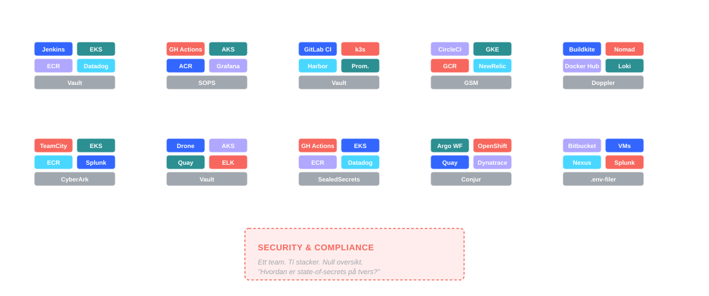

<!--

[REGI]
- diagnose-fasen åpner
- pek på diagrammet — la det jobbe
- ikke teknisk dybde, fokuser på mønsteret

[STIKKORD]
- hver boks = ett team som måtte bygge selv
- ikke fordi de ville — fordi alternativet var ingen plattform
- ti versjoner av samme fundament, ti måter å misforstå sikkerhet på
- security-boksen: ingen sjanse til å håndheve compliance på ti stacker
- "dette er hva 'vi har en plattform' ofte betyr i praksis"

[POENG]
- treffer CTO-personaen direkte — dette er kostnaden av tilfeldighet

[BRO]
- "men ikke bare på org-nivå — også per utvikler" → kognitiv last

[BAKGRUNN]
- scenarioet: ti team eier appen OG runtimen — hver velger egen CI/CD, K8s-oppsett, registry, monitoring, secrets; hvert team trenger dyp kompetanse i hvert eneste lag
- selskapene som skalerte gjennom dette (Airbnb, Spotify) kom uavhengig til samme svar: legg inn et plattform-lag så utviklere self-server og ops slutter å være ticket-kø
- organisasjonen har ikke et verktøyproblem — den har et system- og koordineringsproblem

-->

---

<!-- _transition: 'fade 1s' -->

# Cloud-native ble for mye for ett menneske

<svg xmlns="http://www.w3.org/2000/svg" viewBox="0 0 1100 480" font-family="Arial, Helvetica, sans-serif" style="width:100%; height:auto;">
  <defs>
    
  </defs>
  <g font-size="16">
    <rect class="pill" x="320" y="100" width="92" height="30" rx="15"/>
    <text class="pill-text" x="366" y="120" text-anchor="middle" font-size="13">GitOps</text>
    <rect class="pill" x="430" y="105" width="100" height="30" rx="15"/>
    <text class="pill-text" x="480" y="125" text-anchor="middle" font-size="13">Argo CD</text>
    <rect class="pill" x="650" y="105" width="100" height="30" rx="15"/>
    <text class="pill-text" x="700" y="125" text-anchor="middle" font-size="13">Istio</text>
    <rect class="pill" x="770" y="100" width="120" height="30" rx="15"/>
    <text class="pill-text" x="830" y="120" text-anchor="middle" font-size="13">Prometheus</text>
    <rect class="pill" x="220" y="155" width="100" height="28" rx="14"/>
    <text class="pill-text" x="270" y="174" text-anchor="middle" font-size="12">CRDs</text>
    <rect class="pill" x="480" y="155" width="120" height="28" rx="14"/>
    <text class="pill-text" x="540" y="174" text-anchor="middle" font-size="12">CI pipelines</text>
    <rect class="pill" x="620" y="160" width="100" height="28" rx="14"/>
    <text class="pill-text" x="670" y="179" text-anchor="middle" font-size="12">Crossplane</text>
    <rect class="pill" x="740" y="155" width="100" height="28" rx="14"/>
    <text class="pill-text" x="790" y="174" text-anchor="middle" font-size="12">OPA</text>
    <rect class="pill" x="860" y="160" width="120" height="28" rx="14"/>
    <text class="pill-text" x="920" y="179" text-anchor="middle" font-size="12">OpenTelemetry</text>
    <rect class="pill" x="180" y="210" width="80" height="26" rx="13"/>
    <text class="pill-text" x="220" y="227" text-anchor="middle" font-size="11">Backstage</text>
    <rect class="pill" x="280" y="215" width="80" height="26" rx="13"/>
    <text class="pill-text" x="320" y="232" text-anchor="middle" font-size="11">Grafana</text>
    <rect class="pill" x="380" y="210" width="100" height="26" rx="13"/>
    <text class="pill-text" x="430" y="227" text-anchor="middle" font-size="11">SealedSecrets</text>
    <rect class="pill" x="500" y="215" width="80" height="26" rx="13"/>
    <text class="pill-text" x="540" y="232" text-anchor="middle" font-size="11">Service Mesh</text>
    <rect class="pill" x="600" y="210" width="80" height="26" rx="13"/>
    <text class="pill-text" x="640" y="227" text-anchor="middle" font-size="11">Loki</text>
    <rect class="pill" x="700" y="215" width="80" height="26" rx="13"/>
    <text class="pill-text" x="740" y="232" text-anchor="middle" font-size="11">Tekton</text>
    <rect class="pill" x="800" y="210" width="100" height="26" rx="13"/>
    <text class="pill-text" x="850" y="227" text-anchor="middle" font-size="11">Cert-Manager</text>
    <rect class="pill" x="920" y="215" width="80" height="26" rx="13"/>
    <text class="pill-text" x="960" y="232" text-anchor="middle" font-size="11">Falco</text>
    <rect class="pill" x="100" y="125" width="80" height="26" rx="13"/>
    <text class="pill-text" x="140" y="142" text-anchor="middle" font-size="11">Containerd</text>
    <rect class="pill" x="900" y="60" width="100" height="28" rx="14"/>
    <text class="pill-text" x="950" y="78" text-anchor="middle" font-size="12">CNI / CSI</text>
  </g>
  <!-- 5 like lange linjer, radielt mot hjernens senter (540,372) -->
  <path class="crush-line" d="M 425 276 L 494 333"/>
  <path class="crush-line" d="M 477 236 L 515 318"/>
  <path class="crush-line" d="M 540 222 L 540 312"/>
  <path class="crush-line" d="M 603 236 L 565 318"/>
  <path class="crush-line" d="M 655 276 L 586 333"/>
  <image href="icons/Artificial%20Intelligence_Light_2.png" x="480" y="318" width="120" height="120" preserveAspectRatio="xMidYMid meet"/>
  <text class="label" x="550" y="450" text-anchor="middle" font-size="14">Hver utvikler forventes å mestre alt dette — i tillegg til å levere produkt.</text>
</svg>

Kubernetes

Terraform

Helm

Vault

YAML-suppe

<!--

[REGI]
- nullstill perspektivet — fra org til individ
- den kognitive lasten er problemet, ikke verktøyene
- ikke ramse opp navnene mekanisk — la listen i seg selv være vitnesbyrd

[STIKKORD]
- for ti år siden: ett script, to verktøy
- nå: Helm, Terraform, GitOps, OPA, Vault, Argo, Istio, OTel
- forventning: hver utvikler skal kunne alt
- DevOps lovet samarbeid — cloud-native ga kompleksitet
- ikke verktøyenes feil — det er bare for mye for én

[BRO]
- "det er det Platform Engineering svarer på" → definisjon

[BAKGRUNN]
- "you build it, you run it" kollapset i praksis til "du venter på ops for alt utover en image bump"
- det operasjonelle ansvaret ble dyttet på utviklerne: infra, cloud primitives, CI/CD, secrets, compliance — og fortsatt levere produkt
- for de fleste team er det ikke empowering — det er utmattende

-->

---

<!-- _footer: 'platformengineering.org' -->

# Platform Engineering

Disiplinen som bygger **golden paths** — så utviklerne får self-service på det de trenger, uten å vente på ops.

Et skreddersydd lag mellom utvikler og infra. Et **produkt**, ikke et prosjekt.

  
DEV

  
&rarr;

  

    INTERNAL DEVELOPER PLATFORM
    
    
    
    
    
  

  
&rarr;

  
INFRA

<!--

[REGI]
- her morpher "vedlikeholder infrastruktur" inn i den røde IDP-boksen
- la diagrammet bære
- sidetekst kort, ikke les ord-for-ord

[STIKKORD]
- PE = disiplinen som bygger golden paths
- self-service — uten å vente på ops
- skreddersydd lag mellom dev og infra
- produkt, ikke prosjekt
- IDP er den konkrete artefakten

[POENG]
- to nye begreper på ett slide: "golden paths" og "IDP"
- begge utdypes på neste slides — ikke forklar dem her

[BRO]
- "men hva eier teamet egentlig?" → admin/user

[BAKGRUNN]
- PE standardiserer de non-functional requirements: versjonskontroll, CI/CD, runtime, infra, logging/monitoring, security/compliance — hver kategori med sitt eget rotete verktøyutvalg
- plattform-teamet plukker standarder, konfigurerer skikkelig, og tilbyr dem som tjenester
- ikke bare et teknisk initiativ — et organisatorisk: kapabiliteten er det som compounder

-->

---

# Hvert verktøy har to sider

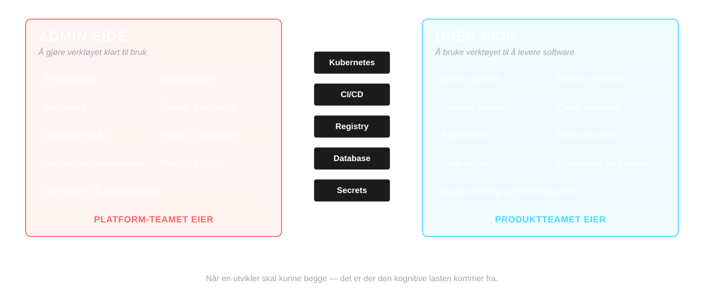

Platform-teamet eier *å drifte* verktøyene. Produktteamene eier *å bruke* dem.

<!--

[REGI]
- klareste forklaringen av hva platform-teamet faktisk gjør
- viktig avklaring: dette er IKKE tilbake til siloed ops
- bruk Kubernetes-eksempelet hvis publikum er teknisk

[STIKKORD]
- hvert verktøy har to sider: drifte vs bruke
- forskjellige fag — ikke samme rolle på forskjellige nivåer
- Kubernetes: egen sertifisering for cluster admin og application developer
- platform-team eier admin-siden av delte verktøy
- produktteam beholder bruker-siden
- forskjell fra gammeldags ops: vi co-designer katalogen — ingen ticketkø

[POENG]
- ops-personaen lytter ekstra her — dette er hvor jobben deres flytter seg

[BRO]
- "ok, så hva er en IDP egentlig?" → er/er ikke

[BAKGRUNN]
- to genuint forskjellige skill sets — Kubernetes har separate sertifiseringer for cluster administrator og application developer fordi de krever hver sin kunnskapsbase
- i tradisjonell DevOps lever begge sidene i samme team — det er DER den kognitive lasten kommer fra
- gammel silo-ops: "ops bestemmer verktøy, gir tilgang via ticket" — PE: "standardiserte tjenester, self-service, katalogen co-designes med teamene"

-->

---

# Internal Developer Platform — en IDP

### Det *er*

- Anbefalte veier for det utviklere gjør oftest
- Selvbetjening — ingen tickets
- Sikkerhet og best practice innebygd fra dag én
- Et **produkt**, ikke et prosjekt

### Det *er ikke*

- En portal
- Et ticketsystem med penere UI
- Et Kubernetes-cluster noen dokumenterte
- En samling verktøy uten sammenheng

<!--

[REGI]
- rydd opp i misforståelser før vi går videre
- venstre lander først, så høyre — kontrast
- ikke les listene — pek på 1-2 punkter per side

[STIKKORD]
- pek venstre: "anbefalte veier" + "produkt, ikke prosjekt"
- pek høyre: "bare en portal" — vanligste misforståelsen
- portal er utstillingsvinduet — plattformen er alt bak

[POENG]
- "portal ingen ba om" forhåndskoder for anti-patterns-sliden senere
- de fleste i salen tenker "vi har dette" — utfordre med "er det bygget med vilje"

[BRO]
- "men hva består en IDP egentlig av?" → fem planes

[BAKGRUNN]
- kjennetegn på ikke-IDP: policy forkledd som workflow, Terraform-wrapper ingen ba om, portal som bare åpner en ticket et annet sted
- føles det som kontroll eller compliance theater, jobber utviklere stille rundt det — og adopsjonstallene lyver

-->

---

# Anatomi av en IDP — fem planes

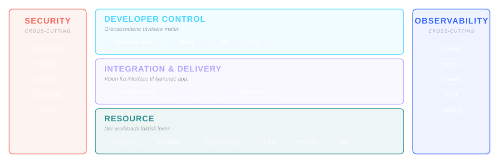

Tre stablede planes utviklere beveger seg gjennom. To tverrgående bånd som krysser alt.

<!--

[REGI]
- navngi planes — pillsene er kart, ikke leseliste
- pek på 1-2 pills per plane som anker, ikke alle
- pek på at Security + Observability er cross-cutting, ikke et lag på bunnen
- 60-75 sek

[STIKKORD]
- Developer Control = utviklerens inngang (workload-spec, portal, API, CLI)
- Integration & Delivery = pipeline-laget (versjonskontroll, CI, CD, orchestrator)
- Resource = der workload-en faktisk kjører (compute, db, storage, dns, nettverk, IAM)
- Security = policy + secrets + identity — tverrgående
- Observability = logger + metrics + traces — tverrgående
- "planes" ikke "lag" — de er parallelle, ikke sekvensielle

[POENG]
- felles språk for IDP-arkitektur — fra McKinseys IDP-referansearkitektur (PlatformCon 2023), spredt via platformengineering.org
- denne strukturen lar dere snakke om "hva mangler vi" på en strukturert måte
- pillsene blir til ports på neste slide — samme element, ny ramme

[BRO]
- "hver av disse pillsene er en port — la oss se hva som fyller dem" → ports & adapters

[BAKGRUNN]
- ingen one-size-fits-all-IDP — men moderne IDP-er deler denne formen
- utvikleren velger selv abstraksjonsnivå i control plane: workload-spec (kode), portal (UI), API, CLI
- velbygde plattformer behandler hver deploy som dag null: app- og infra-konfig genereres
  dynamisk på hver push — det er det som hindrer drift

-->

---

# Ports & adapters — én port, mange verktøy

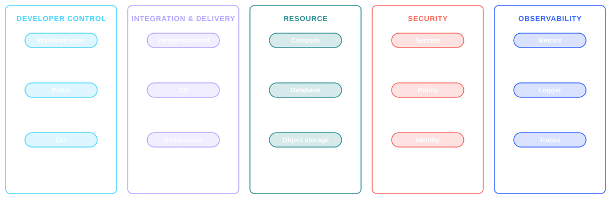

Hver port er et **behov** (versjonskontroll, secrets, metrics). Adapterne under er **valg** — utskiftbare verktøy. Når et team trenger et nytt adapter, vokser katalogen.

<!--

[REGI]
- pek på 1-2 kolonner — ikke gå gjennom alle
- ports & adapters = hexagonal arkitektur — ramme for "abstraksjon vs implementasjon"
- viktigste poeng: porten er kontrakten, adapteret er valget
- 60-90 sek

[STIKKORD]
- port = behovet (versjonskontroll, secrets, metrics)
- adapter = den konkrete implementasjonen (GitHub, Vault, Prometheus)
- katalogen er listen over adapters dere har hardened og støtter
- nye adapters legges til når et team trenger det — escape hatch absorbert
- bytte ett adapter bryter ikke katalogen (forutsetter porten er definert riktig)
- antimønster: "vi har valgt Backstage" som strategi — det er et adapter, ikke en strategi

[POENG]
- denne distinksjonen er hvordan dere unngår å låse dere til feil verktøy
- gjør det også enklere å bytte adapter senere uten å skifte plattform
- "vi støtter både GitHub og GitLab" er en katalog-beslutning, ikke en kompromiss

[BRO]
- "og hjertet i hvordan utviklere møter dette — golden paths" → paved road

[BAKGRUNN]
- fleksibilitet i BRUK, ikke bare valg: parameteriserte IaC-templates — plattformen skriver templaten med best practice innebygd, teamet sender inn parametere
- eksempel: Python-pipeline-template pre-wired med riktige security scans; new-service-template med monitoring og policy hooks på plass
- teamet får standardisering gratis OG beholder rom til å spesialisere

-->

---

# Golden paths er en **paved road** — ikke et gjerde

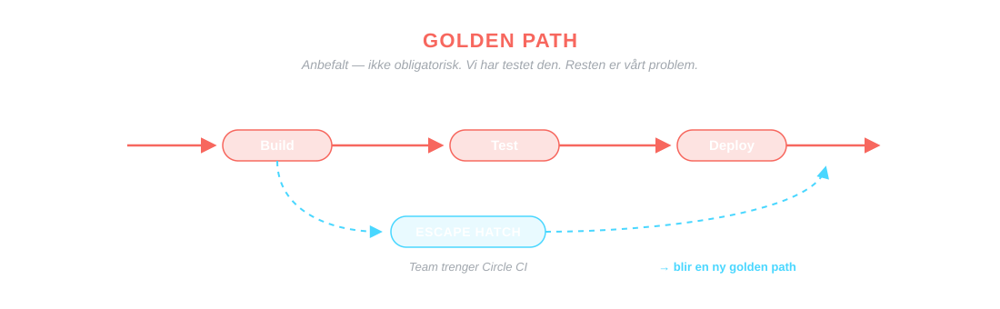

Veien er **anbefalt**, ikke obligatorisk. Den fungerer, dokumentasjonen finnes, vi har testet den. Det finnes alltid en escape hatch — og når et team trenger en, blir den en ny golden path.

<!--

[REGI]
- ikke et gjerde — en vei
- escape hatches = feedback, ikke feil
- den vanligste misforståelsen er at golden path = obligatorisk

[STIKKORD]
- anbefalt, ikke obligatorisk
- veien fungerer, dokumentasjon finnes, vi har testet den
- escape hatch = utvei
- eksempel: team vil ha Circle CI istedenfor GitLab CI
  → ikke "nei", men "ok, vi setter det opp ordentlig"
  → og legger inn i plattformen — blir en ny golden path
- escape hatches er hvordan katalogen vokser — ikke et gap
- unntak: hvis bare ett team trenger det, eier de det selv

[POENG]
- "lite frustrerer utviklere mer enn å bli fortalt at de må gjøre det på én måte"
- paved road = invitasjon, ikke pålegg
- golden path = workflow, ikke verktøy — kan du beskrive den uten å nevne et verktøy?
- start med ÉN path: høy frekvens, høy impact — ikke én per språk/team

[BACKUP]
- "choice has a cost": utviklere sier de vil ha fleksibilitet — de vil ha sane defaults
- tvungen path uten escape hatch: utviklere jobber rundt den i stillhet — adoption-tallene lyver

[BRO]
- "men hva er en golden path egentlig — i én setning?" → quote

[BAKGRUNN]
- mål golden paths på outcomes: time to first deploy, manuelle steg fjernet, frivillig adopsjon — krever adopsjonen håndhevelse, har du en regel, ikke en path
- levende ting: en path som henger etter virkeligheten blir forlatt — og tilliten er vanskelig å vinne tilbake
- kjernen: gjør den riktige tingen til den enkle tingen

-->

---

<!-- _class: accent -->

> *En golden path er ikke en regel.*
>
> *Det er et løfte:*

## **"Gjør det slik — så er resten vårt problem."**

<!--

[REGI]
- hjertet av filosofien
- la det lande — pause
- ikke forklar, ikke utdyp — sitatet jobber selv

[STIKKORD]
- "ikke en regel — et løfte"
- "gjør det slik — så er resten vårt problem"
- gjenta langsomt om nødvendig
- 5-10 sek stillhet er OK her

[BRO]
- klikk inn i "produkt" — løftet er bare ekte hvis platformen vedlikeholdes

-->

---

# Et **produkt**, ikke et prosjekt

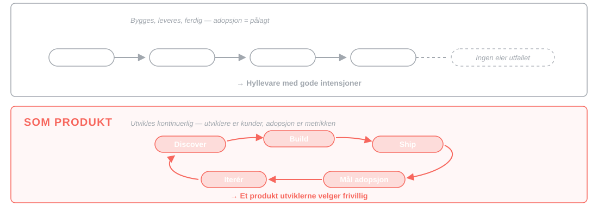

Plattformen leveres ikke ferdig. Den utvikles kontinuerlig — med utviklere som kunder og adopsjon som suksessmetrikk.

<!--

[REGI]
- mindset-skiftet — den enkeltvis viktigste setningen for CTO-publikum
- pek på kontrasten i figuren: prosjekt-linja stopper, produkt-loopen går rundt
- forhåndskoder Team Topologies-callback i timeline

[STIKKORD]
- ikke "vi bygger og leverer ferdig"
- "vi vedlikeholder et produkt for utviklerne våre"
- utviklere = kunder
- adopsjon = suksessmetrikk (ikke features levert)
- kommer fra Team Topologies, Skelton & Pais, 2019

[POENG]
- når CTO hører "produkt, ikke prosjekt" — det er der de fleste platforminitiativ feiler
- finansiering må reflektere dette: vedvarende, ikke prosjektpott

[BRO]
- "men hvor kom dette fra? la oss zoome ut" → timeline

[BAKGRUNN]
- ideen først i ThoughtWorks Tech Radar 2017, popularisert av Team Topologies
- tre pilarer: customer focus (utviklere = kunder), product ownership (roadmap + intern markedsføring), PM-disiplin (user research, metrics, iterasjon)
- plattformen konkurrerer alltid — mot cloud-tilbud, PaaS og utviklernes egne scripts; den vinner bare ved å være genuint bedre enn status quo

-->

---

<!-- _class: timeline -->

# Hvordan kom vi hit?

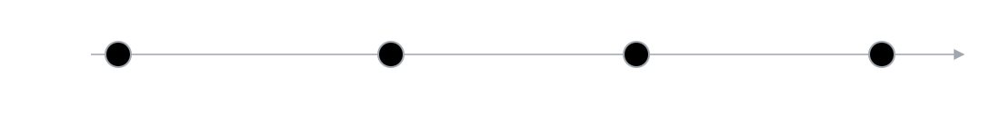

Platform Engineering dukket ikke opp i et vakuum. Det er svaret på et problem som har bygget seg opp i over tjue år.

<!--

[REGI]
- sett scenen — ikke historieleksjon
- vis at PE har lineage og motiv
- fire stopp: 2009, ~2015, 2019, 2022+

[STIKKORD]
- PE dukket ikke opp i et vakuum
- svar på problem som har bygget seg over 20+ år
- ikke buzzword — konsept med opphav

[BRO]
- klikk → 2009

-->

---

<!-- _class: timeline -->

# 2009 — DevOps

**Patrick Debois** ga navn til det alle visste: muren mellom dev og ops må ned.

Kultur. Felles ansvar. *"You build it, you run it."* Revolusjonerende.

Men så kom skyen.

<!--

[REGI]
- åpning av lineage-fortellingen
- rolig tempo — sett scenen før smerten kommer
- ~30 sek

[STIKKORD]
- Patrick Debois, DevOpsDays Ghent
- muren mellom dev og ops må ned
- kultur, felles ansvar
- "you build it, you run it"
- revolusjonerende — for sin tid

[BACKUP]
- hvis noen spør: "you build it, you run it" er Werner Vogels (Amazon, 2006) — ikke Debois

[BRO]
- "men så kom skyen" → 2015

-->

---

<!-- _class: timeline -->

# ~2015 — "You build it, you run it" blir for mye

*Cloud ga oss alt vi trengte — og hundre nye måter å skyte oss selv i foten på.*

Kubernetes. Terraform. Helm. Service meshes. Hver utvikler forventes å være infraekspert.

Senior-devs havner i *shadow operations*. Ticket-køene vokser. Kognitiv last spiser dagen.

**DevOps var ikke feil. Det ble bare for mye for ett menneske å bære.**

<!--

[REGI]
- smerten — alle kjenner seg igjen
- klimakset er den fete linja til slutt
- ~45 sek

[STIKKORD]
- cloud-native eksploderer
- K8s, TF, Helm, service meshes
- hver utvikler skal være infraekspert
- shadow operations på senior-nivå
- ticket-køer vokser
- kognitiv last spiser dagen
- KLIMAKS: DevOps var ikke feil — bare for mye for én

[BACKUP]
- hvis publikum trenger broen tilbake til 2009:
  "DevOps lovet utviklerne autonomi — i praksis fikk de mer ansvar og samme ventetid"

[BRO]
- "noen så at problemet var organisatorisk, ikke teknisk" → 2019

-->

---

<!-- _class: timeline compact -->

# 2019 — Team Topologies

**Matthew Skelton** og **Manuel Pais** navngir fire teamtyper — Stream-aligned, Platform, **Enabling**, og Complicated-subsystem.

Platform-teamet leverer **produktet**. **Enabling-teamet** leverer **capability** — midlertidig, til andre team kan stå på egne ben.

Plattform som produkt. Utviklere er kunder. Grunnmuren for alt vi gjør i dag.

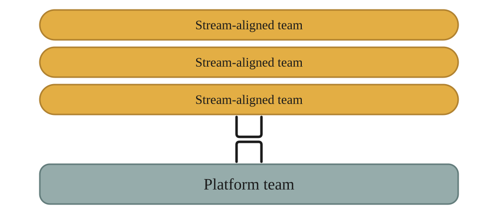

<!--

[REGI]
- nøkkelboken
- pek på TT-figuren — "for de som har lest boken"
- ett poeng: paradigmeskiftet
- 30-45 sek

[STIKKORD]
- Matthew Skelton + Manuel Pais
- fire teamtyper: Stream-aligned, Platform, Enabling, Complicated-subsystem
- Platform-team = leverer produktet (plattformen)
- Enabling-team = gir andre team capabilities de mangler, midlertidig
- nøkkelidé: plattform som produkt
- utviklere = kunder, ikke kolleger
- TT-figur: stream-teams som kunder, platform-team som leverandør
- her legges grunnmuren

[POENG]
- pek kort på figuren: stream-teams blir betjent av platform-teamet
- fremhev Enabling — vi kommer tilbake til det senere (callback før overlevering)
- ikke teknisk gjennomgang av Team Topologies — bare det som ramme

[BACKUP]
- Conway's law hvis spørsmål: arkitekturen speiler kommunikasjonsveiene — derfor er org-design arkitektur-design
- boka begrenser teamansvar til teamets kognitive last — samme problem som slide 7
- NAIS refererer eksplisitt TT: platform-team som produkt-team, X-as-a-Service

[BRO]
- "konseptet fikk navn og hjem" → i dag

-->

---

<!-- _class: timeline -->
<!-- _footer: 'platformengineering.org · 270 000+ medlemmer' -->

# 2022 — Platform Engineering tar form

Gartner: top 10 strategic tech trend for 2023.
platformengineering.org passerer 8 000 medlemmer i 2022 — over 270 000 nå. 
IDP-en blir den konkrete artefakten — **produktet** plattform-teamet leverer.

Ikke DevOps på nytt. Ikke SRE i nye klær. En egen disiplin — med utvikleren som kunde.

<!--

[REGI]
- her tas konseptet fra teori til praksis
- 2022 er startpunktet, men momentumet fortsetter — pek på pilen til høyre
- ikke DevOps på nytt — viktig avklaring

[STIKKORD]
- okt 2022: Gartner top 10 strategic tech trends *for 2023*
- 2022: platformengineering.org passerer 8 000 medlemmer (startet ~1 000 i jan 2022)
- 2026: > 270 000 medlemmer på tvers av kanaler (footer-tallet — vis veksten)
- prediksjon: 80 % av eng-organisasjoner med platform-team innen 2026 (opp fra 45 % i 2022)
- IDP = det konkrete produktet
- egen disiplin — utvikleren som kunde
- ikke DevOps rebranded, ikke SRE i nye klær

[POENG]
- legitimering for executive-publikum: dette er ikke konsulentmote
- pilen i tidslinjen viser at 2022+ ikke er et endepunkt — vi er fortsatt i denne fasen

[BRO]
- "og dette er ikke amerikansk hype — la oss se hva som faktisk kjører i Norge i dag" → norske IDP-er (i drift)

[BAKGRUNN]
- devops vs PE-aksene: mål (samarbeid → self-service), output (kultur → produkt), scope (prosessendring → engineered abstraksjonslag), eier ("alle" → dedikert team)
- PE beholder DevOps-ånden (samarbeid, rask feedback, delt ansvar) men anerkjenner at samarbeid alene ikke skalerer gjennom cloud-native-kompleksitet
- PE leverer på det opprinnelige DevOps-løftet — derfor "ikke DevOps på nytt"

-->

---

<!-- _class: circles -->
<!-- _footer: 'sources: {nav,equinor,sikt,enova}' -->

# Norske IDP-er — i drift

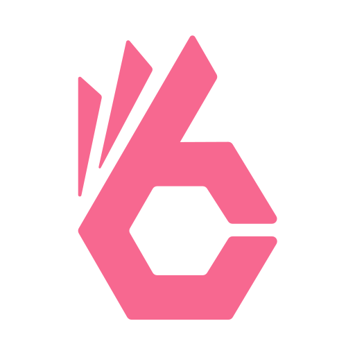  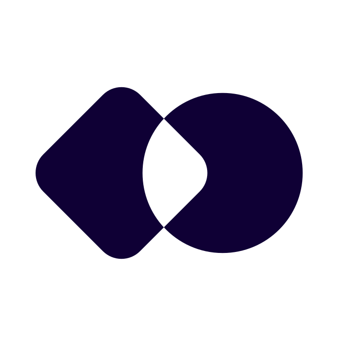 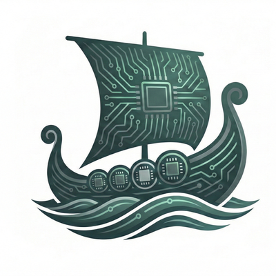

### NAIS — NAV

~100 team, 1 600+ apper i produksjon. Åpen kildekode.

### Radix — Equinor

AKS-PaaS, deklarativ via `radixconfig.yaml`. MIT-lisens. To produksjonsclustere + playground.

### Platon — SIKT

AWS EKS + GitLab. Fellesplattform for kunnskapssektoren. Visjon: *"Norges beste utvikleropplevelse."*

### Njord — Enova

AKS + ArgoCD + Dapr. Lansert mars 2026 som svar på digital suverenitet — bygget for leverandøruavhengighet.

<!--

[REGI]
- proof-point — la tyngden lande
- privat (Equinor) + offentlig (NAV, SIKT, Enova)
- Njord er ferskest — digital suverenitet, ikke bare DevEx
- ikke ramse opp — pek på 1-2 detaljer per IDP

[STIKKORD]
- NAIS (NAV): ~100 team, 1 600+ apper i produksjon, åpen kildekode, NaaS til andre etater
- Radix (Equinor): AKS-PaaS, deklarativ via radixconfig.yaml, MIT, to prod-clustere (North Europe + West Europe) + playground
- Platon (SIKT): AWS EKS + GitLab, fellesplattform kunnskapssektor, "Norges beste utvikleropplevelse"
- Njord (Enova): AKS + ArgoCD + Dapr, lansert 19. mars 2026, motivasjon = digital suverenitet / leverandøruavhengighet
- Njord-utviklerkontrakt: "du er kapteinen på ditt eget skip. Din oppgave er å navigere mot nye mål og levere verdi. Vår oppgave er å sørge for at havet er rolig, vinden er gunstig og at havnen alltid er åpen."

[POENG]
- ikke amerikansk hype — norsk virkelighet
- dere er ikke først
- både privat og offentlig har bygget — på tvers av sektor

[BACKUP]
- NAIS: uttales "nice", startet 2017; Naiserator: én Application-spec → hele K8s-stacken; "it's just Kubernetes — abstractions on top"
- Radix: latin for "rot"; "you provide your code and a Dockerfile — Radix takes it from there"; eksplisitt mål: K8s-kunnskap IKKE nødvendig
- Platon: gresk navnetradisjon (clusteret heter sokrates); "Platon gjør utvikleren god"; prinsipp: 100 % selvbetjening, tynt plattformlag
- Njord: havets gud; clusteret heter Noatun (skipstunet); plattformteamet heter Regin (smeden); ingen egne operators — kun standard controllers

[BRO]
- "men hvorfor — hva er gevinsten?" → verdi-seksjon

-->

---

<!-- _class: invert -->

# Verdien

## For utvikler, ops, og virksomhet

<!--

[REGI]
- section break — pause før konkret nytte
- signaliser skifte: fra hva → hvorfor det matter
- la sliden stå et øyeblikk

[STIKKORD]
- kort: "nå skal vi snakke verdi"
- pause, åndedrett

[BRO]
- klikk → triptyk

-->

---

# Samme plattform — tre vinninger

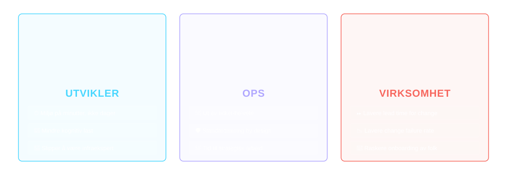

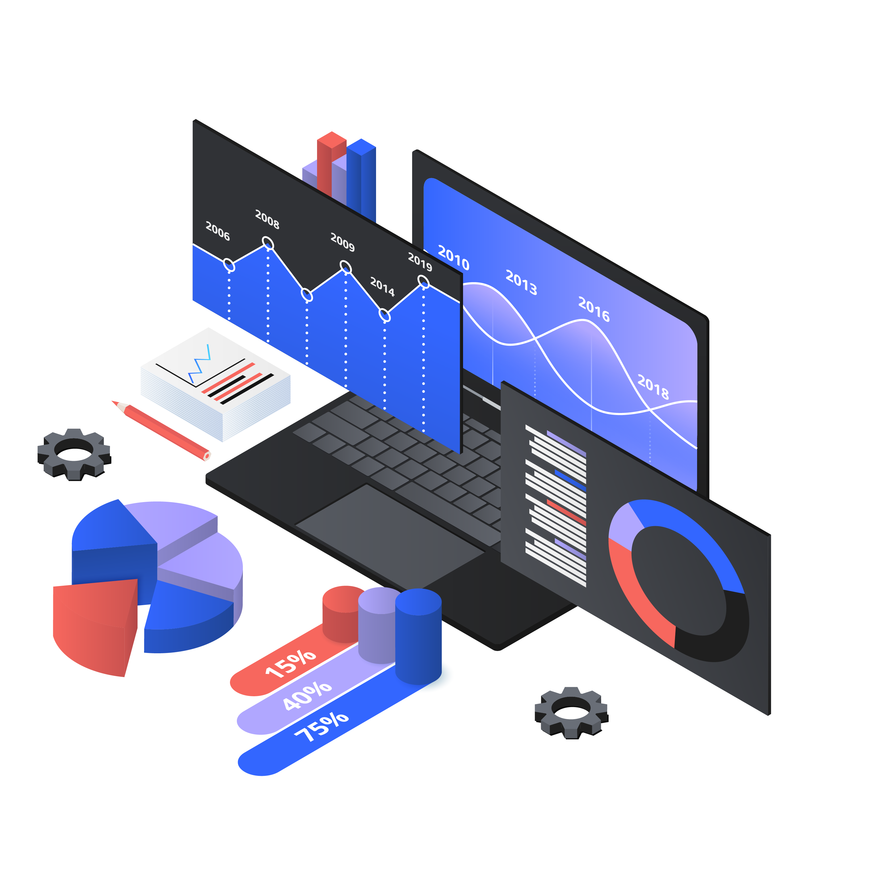

Plattformen er **ikke en IT-kostnad.** Den er en investering i organisasjonens leveringskraft.

<!--

[REGI]
- SVG-en bærer
- pek på hver søyle bare hvis publikum trenger det
- pointe: ikke IT-kostnad, men investering i leveringskraft
- KRITISK at alle tre personas hører seg selv her

[STIKKORD]
- utvikler: tid tilbake, mindre frustrasjon, mer flow
- ops: ikke flaskehals lenger, strategisk arbeid, DORA-metrikker opp
- business: raskere time to market, lavere risiko, governance bevart
- samme plattform — tre vinninger
- ikke en kostnad, en investering

[POENG]
- DORA: change failure rate ned, deploy frequency opp, lead time ned, MTTR ned
- nevn DORA bare hvis salen er teknisk

[BACKUP]
- hvis noen kjenner DORA 2024 og innvender: rapporten fant +8 % individuell og
  +10 % team-produktivitet, men −8 % throughput og −14 % change stability
- viktig nyanse: tapet gjaldt team som ble PÅLAGT å bruke plattformen for alt
  → DORAs hypotese: flere handoffs mellom systemer = mer ventetid
- svar: "det er nettopp derfor golden paths er anbefalt og ikke obligatorisk —
  en plattform du må gjennom er en ny flaskehals, en plattform du vil gjennom er en snarvei"
- eier innvendingen selv hvis salen er DORA-kyndig — det gir troverdighet og
  setter opp paved road-sliden

[BRO]
- "men hvordan måler vi det?" → ROI accent

-->

---

<!-- _class: accent -->

# ROI er ikke en innkjøpskalkyle

> *"Vi kjøpte X. Sparte vi mer enn X?"* — feil spørsmål.

## Platform-ROI er **adferdsendring i skala.**

<!--

[REGI]
- reframe — viktigste setning for CFO/CTO-publikum
- ikke regnskapssyntese, men adferdsendring
- la "adferdsendring i skala" lande før neste klikk

[STIKKORD]
- innkjøpskalkyle = feil ramme
- "kjøpte X, sparte vi mer enn X" — feil spørsmål
- riktig spørsmål: hva endret seg fordi plattformen finnes
- adferdsendring i skala = leverage
- multiplier, ikke kostnadskutt

[BACKUP]
- hvis "hvordan starter vi å måle?": start med en value hypothesis —
  "vi tror self-service reduserer ticket-volum" / "vi tror standardisert deploy reduserer hendelser"
- kan du ikke artikulere hypotesen, kan du ikke regne ROI

[BRO]
- "la oss gjøre det konkret" → tre regnestykker

[BAKGRUNN]
- ROI-trappen: value hypothesis → tidsgevinst (kapasitet skapt) → failure reduction → plattform-effektivitet (tickets ned = tid til nye capabilities) → leveransefart = revenue acceleration
- revenue-eksempel: en feature verdt 500 k USD/år som shipper to måneder tidligere kan alene forsvare investeringen
- mindset: du bygger en multiplier — multipliers vises i throughput og tillit, ikke i procurement-regneark

-->

---

<!-- _footer: 'Tall basert på ~100 utviklere · alternativ ekstern kost · skalerer lineært' -->

# Tre regnestykker — illustrative

### Tid frigjort

100 utviklere × 2 t/uke × 50 uker × 1 500 kr/t

### **≈ 15 MNOK**

Kapasitet frigjort — ikke penger spart.

### Feil unngått

20 færre alvorlige hendelser × 250 000 kr

### **≈ 5 MNOK**

Direkte, målbar risikoreduksjon.

### Hastighet

5 nye utviklere produktive på 1 uke i stedet for 6

### **≈ 1,5 MNOK**

Onboarding-friksjon kuttet med 6×.

<!--

[REGI]
- vær tydelig på at tallene er illustrative — mønsteret er reelt
- ikke prøv å forsvare presisjonen
- la tallene være anker; fortellingen er poenget
- footer-disclaimer er der for de som vil regne på sitt eget tall — pek hvis noen spør
- 60-90 sek

[STIKKORD]
- TID FRIGJORT (~15 MNOK):
  - 100 utviklere × 2 t/uke × 50 uker × 1 500 kr/t
  - kapasitet — ikke spart, frigjort
  - du sparker ikke folk — du flytter timer fra friksjon til verdi
  - 1 500 kr/t = alternativ ekstern kost (konsulent-ekvivalent), ikke intern lønn
- FEIL UNNGÅTT (~5 MNOK):
  - 20 færre alvorlige hendelser × 250 000 kr
  - direkte målbar risikoreduksjon
  - "alvorlig hendelse" = nedetid + responstid + tapt produktivitet
  - executives forstår denne umiddelbart
- HASTIGHET (~1,5 MNOK):
  - 5 nye utviklere produktive på 1 uke i stedet for 6
  - 5 × 5 uker spart × 40 t × 1 500 kr/t
  - onboarding-friksjon kuttet med 6×
  - resonerer på tvers av bransjer — alle ansetter

[POENG]
- "directional confidence, ikke regnskapsprecisjon"
- dette er retning, ikke regnskap
- en eneste plattform-shift kan låse opp >2 MNOK reelt — empirisk fra felt
- modellen er platformengineering.org sin ROI-tilnærming (100 eng × 2 t/uke × timekost) — ikke hjemmesnekret

[BRO]
- "ok, hvordan starter vi uten å rive ned alt?" → hvordan-seksjon

-->

---

<!-- _class: invert -->

# Hvordan starter du?

## Uten å rive ned alt

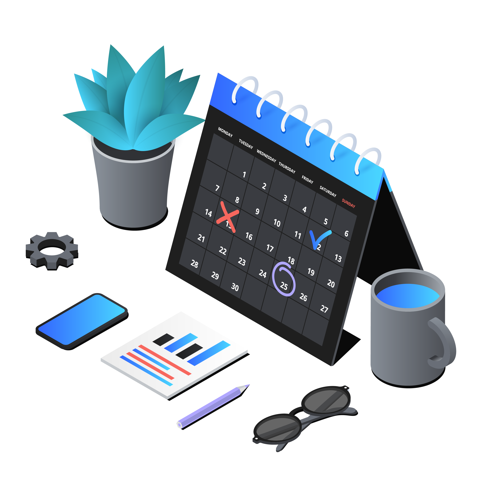

<!--

[REGI]
- section break
- vi har vist hva og hvorfor — nå hvordan
- "uten å rive ned alt" = nøkkelfrase, ofte den som beroliger CTO

[STIKKORD]
- kort, la sliden stå
- pause før klikk

[BRO]
- klikk → MVP

-->

---

# Start med en **Minimum Viable Platform**

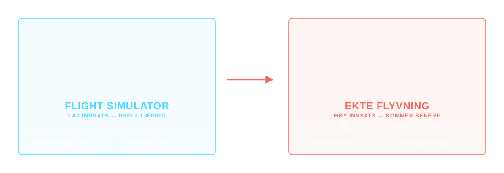

Lav innsats. Lav risiko. Reell læring. **Ikke produksjon — ikke ennå.** Du finner de ødelagte kontrollene mens stakes fortsatt er lave.

<!--

[REGI]
- flight simulator-metafor: lav risiko, reell læring
- ikke produksjon ennå
- pilot-team, ikke alle samtidig

[STIKKORD]
- MVP = bevisst startpunkt, ikke utvanning
- tre egenskaper:
  - representativ (vanlige mønstre, ikke edge cases)
  - repeterbar (kan utvides til neste team)
  - iterativ (forbedres på reell bruk)
- ett pilot-team — innovator/early adopter
- bare non-prod
- vis verdi raskt — ikke bevis at du kan bygge alt

[POENG]
- "du finner de ødelagte kontrollene mens stakes er lave" — bruk denne formuleringen

[BACKUP]
- hvis "hvordan gjør vi det konkret?": fire faser — discovery (viktigst, oftest forhastet), integration, deployment (ende-til-ende demo), adoption planning
- vanligste MVP-feil: rushe til kompleksitet, verktøy ≠ outcomes, glemme brukerne
- DX gjelder ikke bare utviklere — security, finans og ledelse er også brukere
- tilpass demoen: engineers vil se workflows/escape hatches, finans kost, ledelse fart og risiko

[BRO]
- "men hvor møter vi pilot-teamet?" → maturity gradient

-->

---

# Møt teamene **der de er**

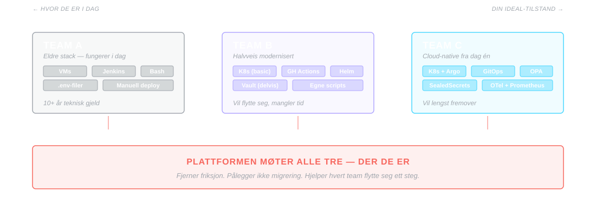

Plattformen formes av virkeligheten i produktteamene — ikke av idealtilstanden din. Hjelp dem flytte seg inkrementelt. Versjon 1 må kanskje støtte litt av det gamle før den fortjener å utvikle seg bort fra det.

<!--

[REGI]
- subtilt men kritisk poeng
- vanlig feil: dra alle på en moderne plattform i ett jafs
- denne sliden er forsikring mot motstand i teamene

[STIKKORD]
- plattformen formes av virkeligheten — ikke ideelltilstand
- inkrementell flytting, ikke big bang
- v1 må kanskje støtte litt av det gamle
- senere fortjener den å utvikle seg bort fra det
- jobben er å fjerne friksjon — IKKE pålegge migrering
- press for hardt = motstand (rimeligvis)

[BRO]
- "og det leder til den vanligste feilen" → wrong way

-->

---

# **Feil** måte å starte på

### ✗ Feil åpningstrekk

*«Velg én CI/CD — og migrer alle.»*

Løser ingen smerte teamene faktisk føler. Legger på arbeid.

**Møtes med motstand.**

### ✓ Riktig åpningstrekk

*«Vi tar den verste delte smerten.»*

K8s-drift, secrets, observability. Fjerner arbeid fra dag én.

**Tjener credibility.**

Standardisering kommer senere — først må du tjene retten til den.

<!--

[REGI]
- antipattern-vaksinasjon før vi viser Canopy
- ikke standardisering først — credibility først
- denne motvirker den klassiske "vi velger CI/CD-stack først"-feilen

[STIKKORD]
- feil åpning signaliserer regler, ikke hjelp
- riktig åpning: ta den verste delte flaskehalsen FRA dem
- tjen retten til å standardisere — etter du har levert verdi

[POENG]
- "tjen credibility først" = signalord for CTO som har sett initiativ feile

[BRO]
- "med det i bakhodet — la oss se på hva vi har bygget" → Canopy

[BAKGRUNN]
- kandidater for "verste delte smerte": verktøy mange team allerede bruker dårlig — K8s cluster ops, secrets management, observability-oppsett
- standardiser før du har tjent kreditten, og du blir ignorert — teamene har ikke spare-kapasitet til å migrere før du har frigjort den

-->

---

# Hva vi bygger i SoftwareOne

Vi har bygget **Canopy** — vår egen interne utviklingsplattform, på åpne standarder:

- **Kubernetes** — sky-agnostisk, ingen vendor lock-in
- **Argo CD** (Apps-of-Apps) — deklarativ, versjonert leveranse
- **Custom operatorer** — skreddersydd automasjon for plattform-workflows
- **OIDC** — føderert identitet på tvers av plattformen

PoC-en er ferdig. Nå bygger vi **produktlaget**: golden paths, dokumentasjon, feedback loops.

<!--

[REGI]
- konkret — ikke salgspitch
- "vi gjør dette selv"
- mest detaljerte tekniske slide; tempo opp lett
- ~60 sek

[STIKKORD]
- Canopy = SoftwareOnes interne utviklingsplattform
- åpne standarder — ikke vendor-lock
- Kubernetes — sky-agnostisk fundament
- Argo CD med Apps-of-Apps — deklarativ leveranse, versjonert
- custom operatorer — skreddersydd plattform-automasjon (Håvard demonstrerer senere)
- OIDC — føderert identitet
- PoC ferdig — nå bygger vi produktlaget:
  - golden paths
  - dokumentasjon
  - feedback loops

[POENG]
- vi har laget motoren — nå pakker vi det inn for utviklere
- akkurat det vi nettopp definerte: produkt, ikke prosjekt
- bevis at vi følger vår egen lære

[BRO]
- "og vi kan hjelpe dere komme dit også" → Enabling Team as a Service

-->

---

# Enabling Team as a Service

Du trenger ikke ansette et komplett platform-team på dag én.

**SoftwareOne kan fungere som et midlertidig enabling team** — bygge MVP-en sammen med dere, etablere golden paths, og overlevere når deres eget platform-team er klart.

Callback til Team Topologies: et enabling team eksisterer for å gi andre team capabilities de mangler — og oppløses, eller flyttes, når jobben er gjort.

<!--

[REGI]
- rolig pitch — ikke salgsstil
- callback til Team Topologies-slide (2019) — pek tilbake i tid
- ~45 sek

[STIKKORD]
- dere trenger ikke ansette et helt platform-team for å komme i gang
- Enabling Team = team-typen fra Team Topologies (callback)
- oppgave: gi andre team capabilities de mangler — midlertidig
- SoftwareOne kan kjøre den rollen:
  - bygge MVP sammen med dere
  - etablere golden paths
  - kunnskapsoverføring
  - overlevere til kundens eget platform-team
- ikke "vi tar over driften for alltid" — vi setter dere i stand til å eie det selv

[POENG]
- platform engineering = capability, ikke headcount
- midlertidig enabling team = lavere risiko enn å bygge et komplett team før dere vet hva dere trenger

[BRO]
- "og for å vise hvordan det kan se ut konkret, hører dere fra Håvard og Marius etter pausen" → teasers

[BAKGRUNN]
- PE er en capability, ikke en stillingstittel — én "platform engineer" som skal dekke infra + DX + security + produkt er ikke en rolle, det er et team
- start med problemstatement, ikke "vi vil ha en plattform": "onboarding tar for lang tid", "prod-incidents gjentar seg av samme årsak"
- tidlige team: små, seniore, opinionated — 2-4 sterke folk er nok til å starte

-->

---

# Etter pausen — to konkrete eksempler

### Håvard — Kubernetes Operators

Hvordan reduserer vi kompleks infrastruktur til én utviklervennlig ressurs?

Live-bygg av en controller — operator-mønsteret i praksis.

### Marius — Canopy live

Fra onboarding av ny utvikler til app i prod.

Automatisk repo, CI-pipeline, og deploy via ArgoCD.

Det er ikke et ferdig produkt — vi starter en **samtale**.

<!--

[REGI]
- kort og praktisk — ikke salgspitch
- pek på de to konkrete eksemplene — la dem teasere
- plass for screenshots fra Håvard/Marius (legges inn hvis BK rekker)
- ~30 sek

[STIKKORD]
- Håvard: operator-mønsteret — motoren under plattform-automasjon
- Marius: Canopy live — onboarding til prod, demo med ArgoCD
- begge ER kapabiliteten — bevis på at platform engineering = capability
- vi starter samtale, ikke salgssyklus

[POENG]
- handover demonstrerer "platform engineering = kapabilitet, ikke ett rolleansvar"
- ikke nevn det eksplisitt — la det være implisitt

[BRO]
- "men før vi gir over: la oss se på hva som ofte går galt" → anti-mønstre

-->

---

# **Slik feiler det** — tre mønstre

### Bare nytt skilt

Døp om ops-teamet til platform-team. Samme tickets, samme køer.

**Samme kø, nytt navn.**

### Bygg for deg selv

Ex-ops bygger det *de* kjenner. Løser ops-problemer, ikke utviklerproblemer.

**Et år arbeid, feil problem.**

### Portal ingen ba om

*"Developer portals er hot."* Bygges uten brukerresearch.

**Demo imponerte. Ingen logget inn igjen.**

Tre feil. Én rotårsak: **bygget uten å snakke med utviklerne.**

<!--

[REGI]
- 60-90 sek total
- tre kort, én per persona — ops, dev, business
- la felles rotårsak lande til slutt
- bruk warning-fargen aktivt: dette er fallgruver, ikke gode råd

[STIKKORD]
- ett kort per persona: ops / dev / business
- SKILT: "DevOps med finere navn"
- SELV: god intensjon — feil retning
- PORTAL: prestisjeprosjekt, null research
- rotårsaken lander til slutt — pek på linja

[POENG]
- platform engineering uten samtalen er bare kostnad
- inspirert av "9 steps to platform engineering hell" (Luca Galante) — virkelige feilmoduser
- denne sliden er det executives husker — bruk den

[BACKUP]
- flere steg fra samme kilde hvis spørsmål: jage ny teknologi uten grunn (Jenkins → GHA → Crossplane → ...),
  "you're not that special" (custom K8s for å selge sko på nett), fire parallelle IDP-initiativ i siloer,
  skjule sunk costs bak pynte-metrikker — og de beste på teamet slutter først

[BRO]
- "så, tilbake til åpningen" → closing accent

[BAKGRUNN]
- to grunnårsaker bak nesten alle feilmodusene: hoppe over platform-as-a-product-mindsetet, og hoppe over kommunikasjonsarbeidet
- beslektede feller: build-here-syndrom (bygge selv det som finnes open source), loudest voice fallacy (bygge det det høyeste teamet krever — ikke det research validerer)

-->

---

<!-- _class: accent -->

> *Hvis utviklerne dine bruker tid på noe annet*
> *enn å skrive software som skaper verdi*

## Da har du et **plattformproblem**.

<!--

[REGI]
- la setningen lande — pause
- ingen utdyping — sitatet jobber

[STIKKORD]
- "tid på noe annet enn verdiskapende kode = plattformproblem"
- gjenta langsomt om publikum trenger det
- pause 5+ sek

[POENG]
- omformulering av åpningshookene — løkken lukkes

[BRO]
- "her er tre spørsmål dere kan ta med dere" → tre spørsmål

-->

---

# Tre spørsmål å ta med hjem

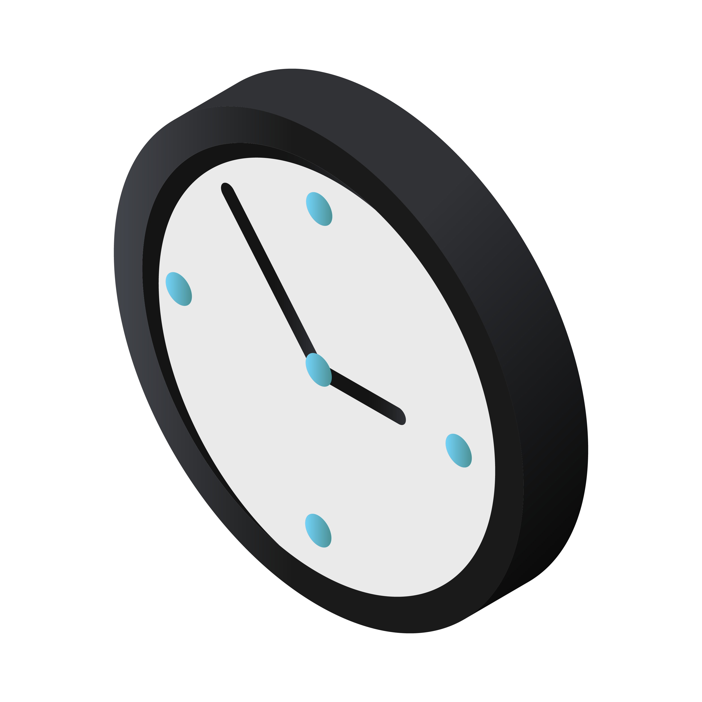

1. Hvor lang tid tar det fra idé til kjørende tjeneste i prod?
2. Hvor mange tickets håndterer ops som ikke burde eksistert?
3. Hvor lenge før fem nye utviklere er produktive?

Svarene beskriver **plattformgapet deres.**

<!--

[REGI]
- konkrete diagnostiske spørsmål — de skal kunne ta dem med
- ikke svar — la spørsmålene henge
- ett spørsmål per persona (dev / ops / business)

[STIKKORD]
- les spørsmålene rolig — ett per persona (dev / ops / business)
- skarpere variant på 3 hvis erfaren sal: "hvor lenge før første kodelinje i prod?"
- svarene = plattformgapet — og gapet har en pris

[POENG]
- la siste linje "gapet har en pris" lande hardt — det er kroken
- ikke utdyp — pause, klikk

[BRO]
- "og når dere har svarene — her er målbildet" → final

-->

---

<!-- _class: accent has-deco -->

# Målbildet

En organisasjon der utviklere skriver **software som skaper verdi** — ikke kjemper med infrastruktur under.

En plattform som er **et produkt**, ikke et prosjekt.

Raskere leveranser. Lavere risiko. Mindre teknisk gjeld.

## Det er det Platform Engineering leverer.

<!--

[REGI]
- avslutning — lukk løkken
- "det er det Platform Engineering leverer" = mic drop
- pause før takk og spørsmål

[STIKKORD]
- ikke les punktene — de er oppsummeringen publikum allerede har hørt
- sluttlinje: "det er det Platform Engineering leverer" — så stille

[POENG]
- løkken lukkes: åpningshookene → diagnose → svar → målbildet

[BRO]
- takk → Q&A eller direkte til pause
- ikke be om spørsmål før etter pausen hvis tid er stram

-->

---

<!-- _class: lead -->
<!-- _paginate: false -->
<!-- _header: '' -->
<!-- _footer: 'slides @ github.com/bjornkpu/talks' -->

# Takk

Bjørn Kristian Punsvik

<!--

[REGI]
- la sliden stå under Q&A / inn i pausen

[STIKKORD]
- takk — spørsmål nå hvis tid, ellers i pausen
- Håvard og Marius fortsetter etter pausen

-->

